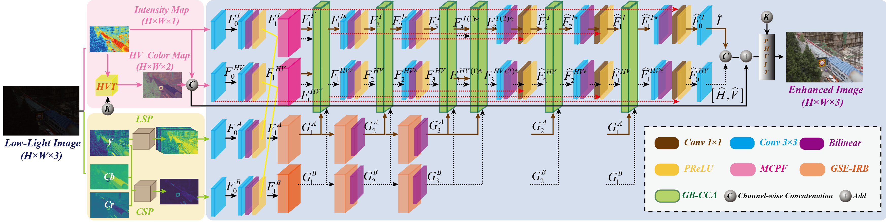
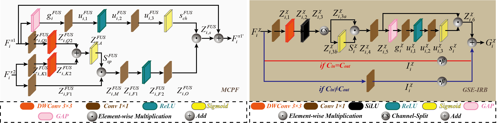

## Dataset

The datasets used in this work can be downloaded from the following Baidu Pan links.

<table align="center">
  <thead>
    <tr>
      <th align="left">Dataset</th>
      <th align="center">Link</th>
      <th align="center">Extraction Code</th>
    </tr>
  </thead>
  <tbody>
    <tr>
      <td align="left">LOLv1</td>
      <td align="center"><a href="https://pan.baidu.com/s/1H4-MvvcV7XDY4tfxwJhWxg">Baidu Pan</a></td>
      <td align="center"><code>xyys</code></td>
    </tr>
    <tr>
      <td align="left">LOLv2</td>
      <td align="center"><a href="https://pan.baidu.com/s/1XFonCZNLxc19nt5mE2XnIQ">Baidu Pan</a></td>
      <td align="center"><code>xyys</code></td>
    </tr>
    <tr>
      <td align="left">DICM / LIME / MEF / NPE / VV</td>
      <td align="center"><a href="https://pan.baidu.com/s/1T0Hn_yGwiAMYKaI6zKXNWQ">Baidu Pan</a></td>
      <td align="center"><code>xyys</code></td>
    </tr>
    <tr>
      <td align="left">Sony-Total-Dark (SID)</td>
      <td align="center"><a href="https://pan.baidu.com/s/1zBnt0AHtB7X1Bf7RviMPLw">Baidu Pan</a></td>
      <td align="center"><code>xyys</code></td>
    </tr>
    <tr>
      <td align="left">LSRW dataset</td>
      <td align="center"><a href="https://pan.baidu.com/s/1-HvOY0n9vx3EodSDw5nkWw">Baidu Pan</a></td>
      <td align="center"><code>xyys</code></td>
    </tr>
  </tbody>
</table>

## Figures

Fig. 1. Typical application scenarios of LLIE techniques.

Fig. 2. YCbCr-guided HVI enhancement and quantitative validation.

Fig. 3. Workflow of the proposed BIP-CENet.

Fig. 4. Detailed structure of the GB-CCA.

Fig. 5. Detailed structures of MCPF and GSE-IRB.

Fig. 6. Visual comparison on the LOLv2-Real dataset.

Fig. 7. Visual comparison on the LIME, NPE, and MEF datasets.

Fig. 8. BIP-CENet results in underground engineering scenes.

