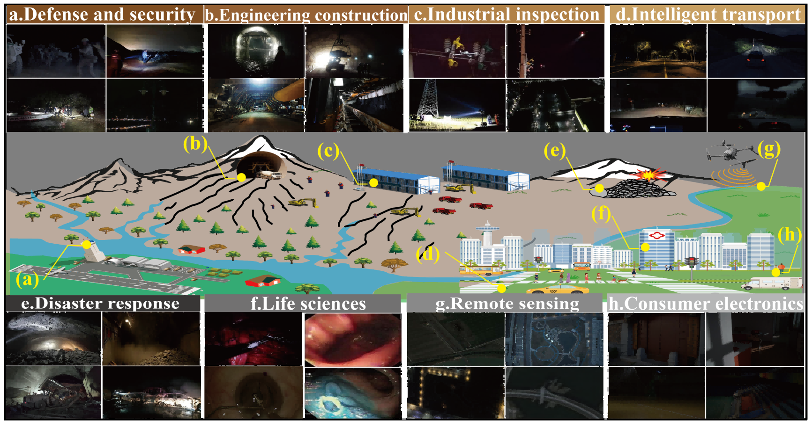
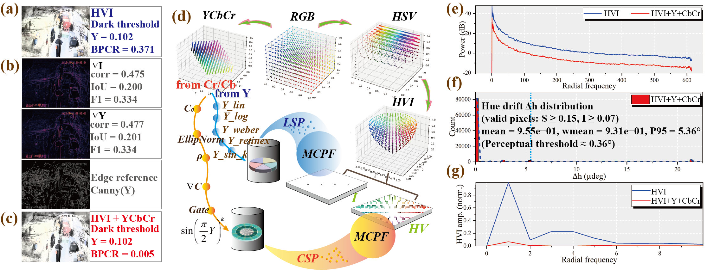
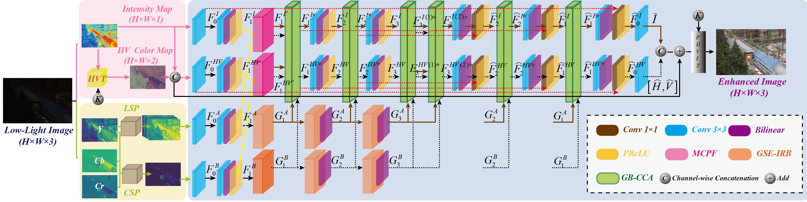
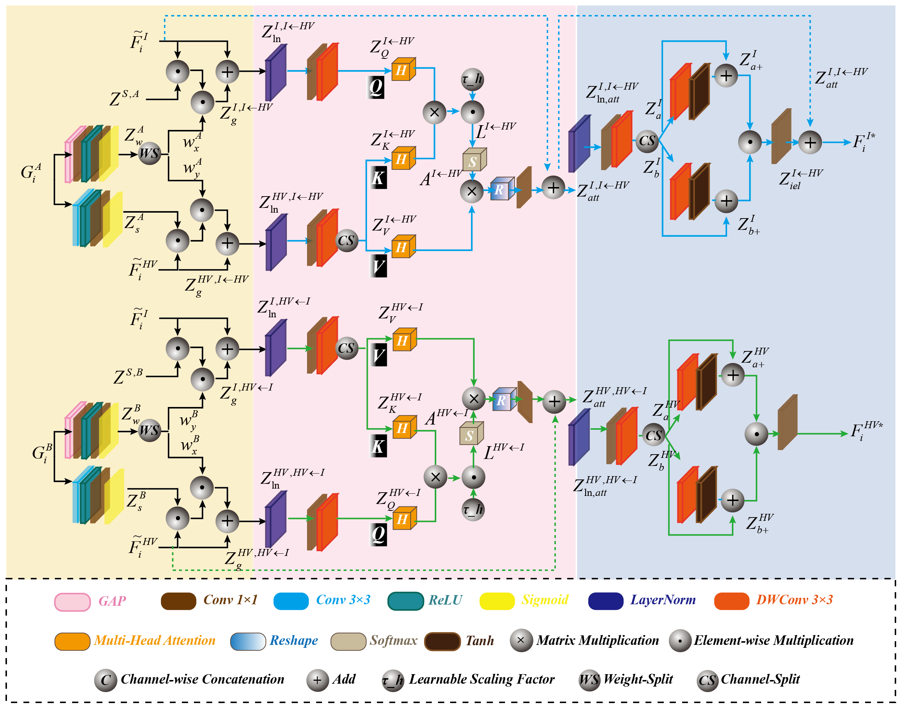
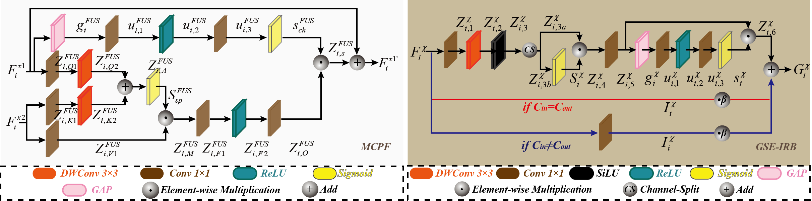
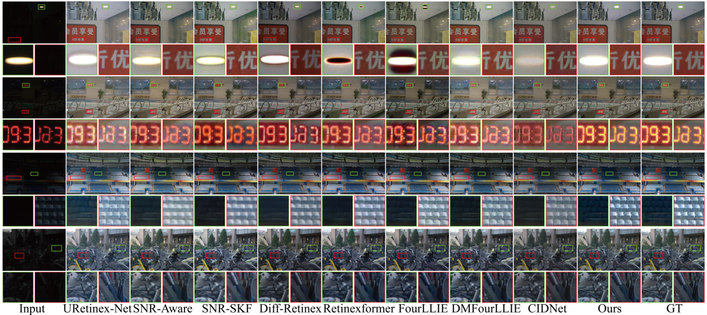
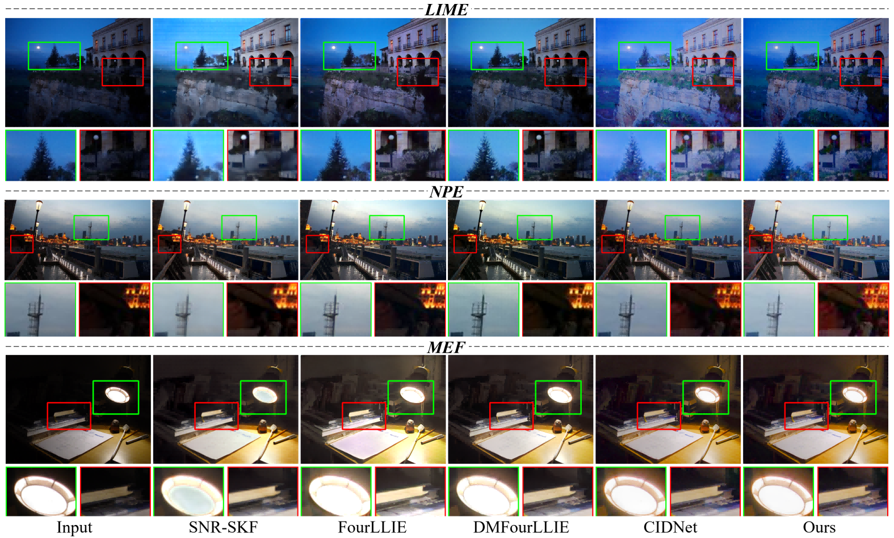
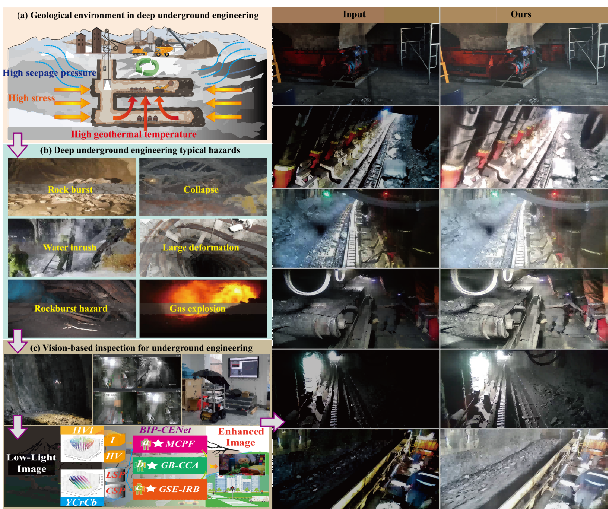

  <a href="./Readme_CN.md">🌐 中文</a> |
  <a href="./Readme.md">🌐 English</a>

<h1 align="center">🌙 BIP-CENet👁️</h1>

  <strong>BIP-CENet: A Bilateral Prior–Collaborative Enhancement Network with Dual-Domain Priors for Low-Light Image Enhancement</strong>

  A low-light image enhancement framework built on HVI representation and YCbCr-domain dual priors.

  
  
  
  

---

## 🧾 Overview

BIP-CENet is a low-light image enhancement framework that combines the HVI representation with dual-domain priors defined in the YCbCr space.  
Specifically, it introduces a luminance statistical prior (LSP) from the Y channel and a chrominance structure prior (CSP) from the Cb and Cr channels to complement the HVI representation in luminance recovery, chrominance modeling, and detail preservation.  
The network adopts a dual-branch architecture and includes three key components: MCPF, GB-CCA, and GSE-IRB.

---

## 📦 Dataset

The datasets used in this work can be downloaded from the following Baidu Pan links.

<table align="center">
  <thead>
    <tr>
      <th align="center">Dataset</th>
      <th align="center">Download</th>
      <th align="center">Extraction Code</th>
    </tr>
  </thead>
  <tbody>
    <tr>
      <td align="center">LOLv1</td>
      <td align="center"><a href="https://pan.baidu.com/s/1H4-MvvcV7XDY4tfxwJhWxg">Baidu Pan</a></td>
      <td align="center"><code>xyys</code></td>
    </tr>
    <tr>
      <td align="center">LOLv2</td>
      <td align="center"><a href="https://pan.baidu.com/s/1XFonCZNLxc19nt5mE2XnIQ">Baidu Pan</a></td>
      <td align="center"><code>xyys</code></td>
    </tr>
    <tr>
      <td align="center">DICM / LIME / MEF / NPE / VV</td>
      <td align="center"><a href="https://pan.baidu.com/s/1T0Hn_yGwiAMYKaI6zKXNWQ">Baidu Pan</a></td>
      <td align="center"><code>xyys</code></td>
    </tr>
    <tr>
      <td align="center">Sony-Total-Dark (SID)</td>
      <td align="center"><a href="https://pan.baidu.com/s/1zBnt0AHtB7X1Bf7RviMPLw">Baidu Pan</a></td>
      <td align="center"><code>xyys</code></td>
    </tr>
    <tr>
      <td align="center">LSRW Dataset</td>
      <td align="center"><a href="https://pan.baidu.com/s/1-HvOY0n9vx3EodSDw5nkWw">Baidu Pan</a></td>
      <td align="center"><code>xyys</code></td>
    </tr>
  </tbody>
</table>

---

## 🖼️ Figures

### **Fig. 1. Typical application scenarios of LLIE techniques.**

  

### **Fig. 2. YCbCr-guided HVI enhancement and quantitative validation.**

  

### **Fig. 3. Workflow of the proposed BIP-CENet.**

  

### **Fig. 4. Detailed structure of the GB-CCA.**

  

### **Fig. 5. Detailed structures of MCPF and GSE-IRB.**

  

### **Fig. 6. Visual comparison on the LOLv2-Real dataset.**

  

### **Fig. 7. Visual comparison on the LIME, NPE, and MEF datasets.**

  

### **Fig. 8. BIP-CENet results in underground engineering scenes.**

  

---

## 🧩 Core Priors and Modules

<table align="center">
  <thead>
    <tr>
      <th align="center">Name</th>
      <th align="center">Description</th>
    </tr>
  </thead>
  <tbody>
    <tr>
      <td align="center"><strong>LSP</strong></td>
      <td align="center">Luminance statistical prior constructed from the Y channel to compensate for the intensity representation.</td>
    </tr>
    <tr>
      <td align="center"><strong>CSP</strong></td>
      <td align="center">Chrominance structure prior derived from the Cb and Cr channels to enhance chrominance and structural modeling.</td>
    </tr>
    <tr>
      <td align="center"><strong>MCPF</strong></td>
      <td align="center">Modulated Cross-Projection Fusion for shallow fuse-then-encode prior injection.</td>
    </tr>
    <tr>
      <td align="center"><strong>GB-CCA</strong></td>
      <td align="center">Guided Bilateral Channel Cross-Attention for prior-guided bidirectional interaction between luminance and chrominance branches.</td>
    </tr>
    <tr>
      <td align="center"><strong>GSE-IRB</strong></td>
      <td align="center">Gated SE Inverted Residual Block for lightweight detail enhancement and denoising.</td>
    </tr>
  </tbody>
</table>

---

## 🏗️ Application Scene

According to the paper, BIP-CENet is also evaluated in underground engineering scenes, where uneven illumination and low-visibility conditions can significantly affect image usability for inspection and engineering analysis.

---

## 📄 Paper

**Title:**  
BIP-CENet: A Bilateral Prior–Collaborative Enhancement Network with Dual-Domain Priors for Low-Light Image Enhancement

**Authors:**  
You Lv, Ru Zhang, Xinhong Hei, Xiaogang Song, Zetian Zhang, Haiyan Tu, Yuping Tan, Jing Xie, Zhilong Zhang, Xiujuan Zheng, Anlin Zhang, Kun Xiao

**Journal:**  
Knowledge-Based Systems
